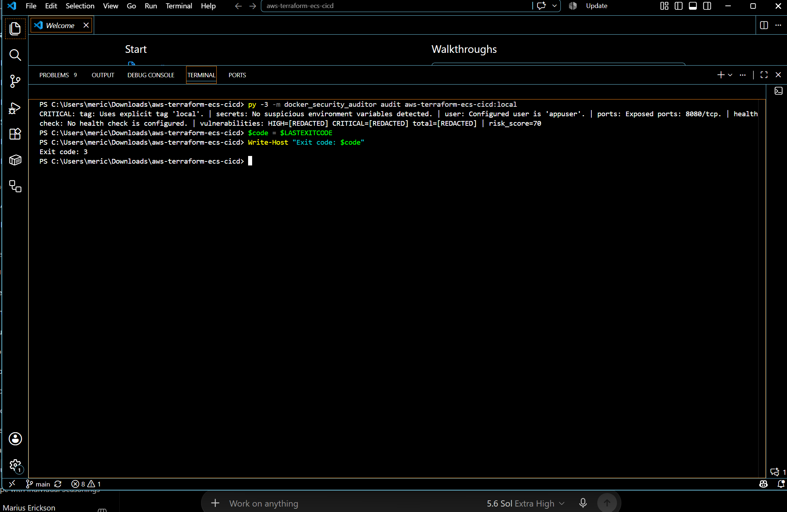
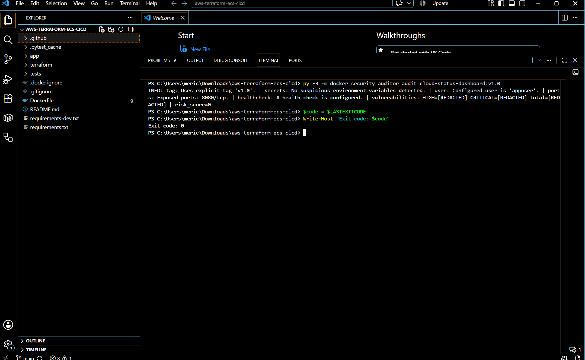
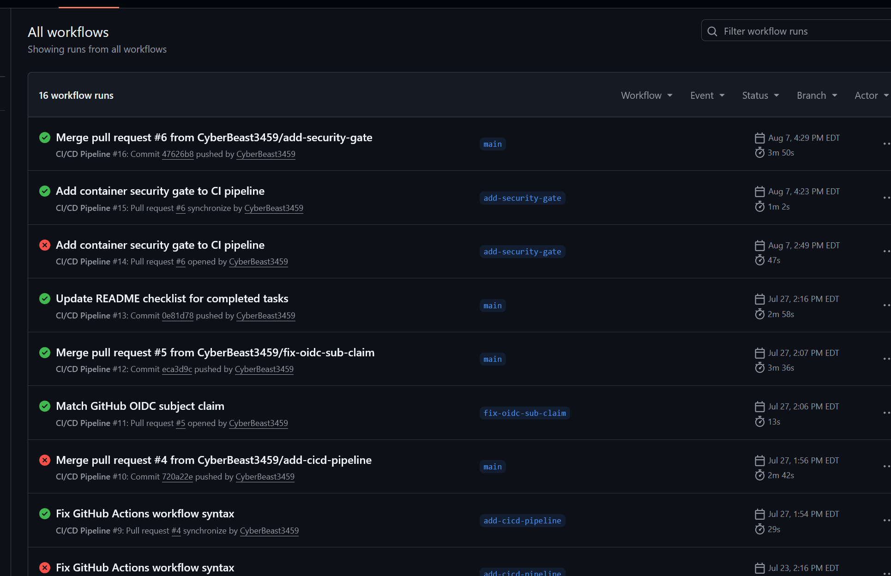

# Docker Security Auditor

Docker Security Auditor is a Python CLI for auditing local Docker images for security risks. It inspects Docker metadata, runs Trivy vulnerability scanning, calculates a deterministic risk score, and returns meaningful exit codes for upstream automation and local review.

## Overview

This project is designed for fast, repeatable security review of local image builds. It combines Docker image inspection with Trivy-based vulnerability detection to surface configuration issues such as mutable tags, root-equivalent users, missing health checks, and secret-like environment-variable naming patterns.

The audit output is intentionally concise in the terminal while also supporting optional structured JSON export for tooling, CI/CD gates, and portfolio reporting.

## Key capabilities

- Local Docker image inspection via the Docker CLI
- Trivy vulnerability scanning with HIGH and CRITICAL filtering
- Deterministic risk scoring from 0 to 100
- Meaningful exit codes for human and automation workflows
- Safe secret detection that reports names without exposing values
- Optional JSON report export with structured result data
- CI/CD-ready gating for security approval workflows

## Security checks

The `audit` command inspects a local Docker image and reports on:

- the configured user, including root-equivalent risk
- declared exposed ports
- whether the image has a health check configured or disabled
- whether the image reference uses the mutable `latest` tag or an explicit digest/tag
- whether secret-like environment-variable names are present without printing their values
- Trivy vulnerability counts for HIGH and CRITICAL findings

Docker inspection and Trivy each run once per audit.

## Screenshots / demonstration

### Vulnerable audit



This result shows a CRITICAL image assessment with a risk score of 70, a missing health check, and an exit code of 3.

### Remediated audit



This result shows the image using an explicit `v1.0` tag, a non-root `appuser`, a configured health check, a risk score of 0, and an exit code of 0.

### CI/CD security gate results



This pipeline example shows the original vulnerable build blocked at the security gate, the remediation branch passing after fixes, and the main deployment path completing successfully. The example CI/CD implementation is available at: https://github.com/CyberBeast3459/aws-terraform-ecs-cicd

## Installation and prerequisites

This repository targets Python 3.9 and newer, as defined in `pyproject.toml`.

Prerequisites:

- Docker installed and available in the local environment
- Trivy installed and available in the local environment
- Python 3.9+

Install from the local repository:

```bash
git clone <repository-url>
cd docker-security-auditor
python -m pip install -e .
```

## Quick start

```bash
docker-security-auditor --help
docker-security-auditor --version
docker-security-auditor audit alpine
docker-security-auditor audit alpine --json-report reports/alpine.json
```

## Risk scoring

The audit calculates a deterministic score from 0 to 100 based on the checks below:

- Mutable latest or implicit-latest tag: +10
- Root-equivalent configured user: +25
- Missing or disabled health check: +10
- One or more secret-like environment variables: +25 total
- HIGH vulnerabilities: +2 each, capped at +20
- CRITICAL vulnerabilities: +10 each, capped at +40
- Declared exposed ports: +0

The final score is capped at 100. The terminal summary prints the score as `risk_score=<value>`, while the overall severity remains based on the highest-severity finding.

## Exit codes

| Severity | Exit code |
| --- | ---: |
| PASS / INFO | 0 |
| MEDIUM | 1 |
| HIGH | 2 |
| CRITICAL | 3 |
| Operational error (Docker/Trivy failure, invalid JSON, timeout, report-write failure) | 4 |

The CLI prints the complete audit result before exiting, even when returning a non-zero exit code.

## JSON reports

Use the optional `--json-report` argument to write a structured report alongside the normal concise terminal output:

```bash
docker-security-auditor audit alpine --json-report reports/alpine.json
```

The JSON report includes:

- `schema_version`
- `image`
- `overall_severity`
- `risk_score`
- `exit_code`
- `vulnerability_counts`
- `results` for each check

The payload never includes environment-variable values or other secret material.

Example JSON report excerpt:

```json
{
  "schema_version": 1,
  "image": "alpine",
  "overall_severity": "CRITICAL",
  "risk_score": 84,
  "exit_code": 3,
  "vulnerability_counts": {
    "high": 2,
    "critical": 1,
    "total": 3
  },
  "results": [
    {
      "check": "tag",
      "status": "MEDIUM",
      "message": "Uses the mutable 'latest' tag implicitly."
    }
  ]
}
```

## CI/CD security-gate integration

The auditor is designed to integrate into deployment gates where a build can be blocked when the audit result exceeds an acceptable threshold. The project is intentionally compatible with automation patterns that inspect exit codes, severity, and generated JSON artifacts before authorizing deployment.

A concrete example is documented in the Terraform and ECS CI/CD project referenced above.

## Security and redaction behavior

The audit reports secret-like environment-variable names such as `PASSWORD`, `TOKEN`, `API_KEY`, `SECRET`, `PRIVATE_KEY`, `ACCESS_KEY`, and `CREDENTIAL` when they are identified. The values themselves are never printed in the terminal or the JSON report.

The tool does not expose real credentials, account IDs, secret values, or vulnerability details in the output.

## Testing

The project uses `pytest` for automated validation.

```bash
python -m pytest
```

This repository does not hardcode the current test count in documentation so the documentation stays accurate as the suite evolves.

## Project structure

- `src/docker_security_auditor/`: Python package source
- `tests/`: automated pytest coverage
- `docs/images/`: project screenshots used in the portfolio and release documentation
- `pyproject.toml`: package metadata and console entry point definition
- `README.md`: project overview and usage documentation

## Focused future roadmap

- Expand the rule set for image content and package-level checks
- Refine structured reporting for downstream automation
- Extend audit coverage for additional Docker security patterns
- Keep the CLI and output stable for portfolio, demo, and operational use
